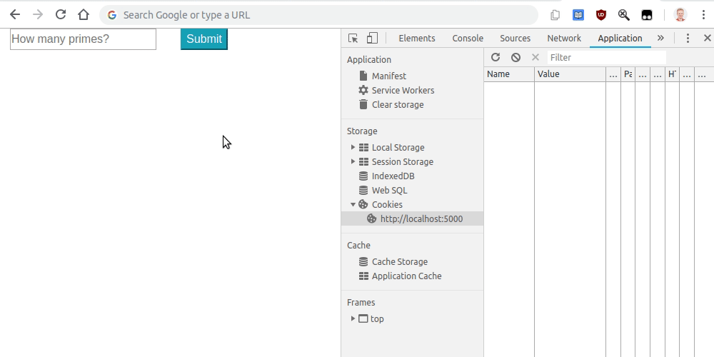
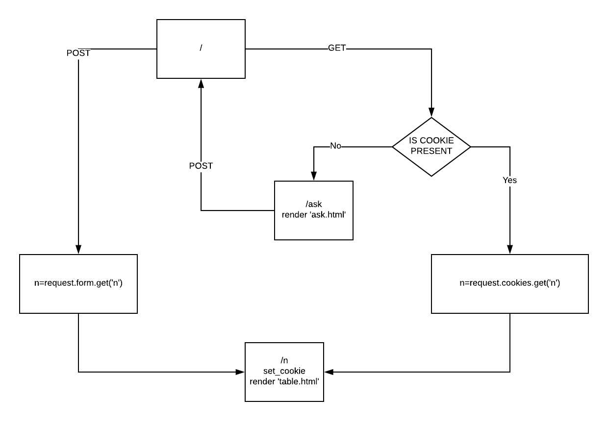

# Using Flask

## Task

Develop and deploy an application using Flask, Jinja2, and Bootstrap

## Bootstrap

Bootstrap files (CSS and JavaScript) are provided. Keep in mind that it's recommended to use CDN for these files and in a real application they would be cached and only downloaded once. At the same time, it's also recommended to disable cache while developing and debugging an application. In order to avoid expensive and time-consuming requests to CDN and learn using local copies these files are provided:

* static/css/bootstrap.min.css
* static/js/bootstrap.min.js
* static/js/jquery-3.2.1.slim.min.js
* static/js/popper.min.js

## Jinja2

It's a recommended way to generate HTML. You can use Python to replace placeholders with dynamically generated values. Make sure *ask.html* and *prime_table.html* **extend** *base.html*

* ask.html
* base.html
* prime_table.html

## Flask

The application should work as follows:

1. When a user visits `http://localhost:5000/<int:n>`, a table of `n` primes is generated. Refer to *exercise1* for the implementation details the prime numbers generator. The table template must be specified in the *prime_table.html*. As the table is generated, a *cookie* should be set with `n` as a value.

2. When a user visits `http://localhost:5000/ask`, they are presented with a text field and a button. The form template must be specified in *ask.html*. When the button is clicked, user should be redirected to `http://localhost:5000/` with the text field value as a request argument (if using **GET**) or form value (if using **POST**).

3. When a user visits `http://localhost:5000/`, the application should check the following conditions:

    * The request has any arguments (i.e. the user comes from `http://localhost:5000/ask`). Redirect the user to `http://localhost:5000/<int:n>` (`n` is provided by the user)

    * The request is empty (i.e. not a redirect from `http://localhost:5000/ask`) but a cookie is present. Redirect the user to `http://localhost:5000/<int:n>` (`n` is read from the cookie)

    * Redirect the user to `http://localhost:5000/ask` by default.

## Deployment

You should test your application locally (set the application name and use `flask run` to start it) prior to deployment. Once the application is working on your local machine, deploy it to https://pythonanywhere.com/.

## References

* [Quickstart — Flask 1.0.2 documentation](http://flask.pocoo.org/docs/1.0/quickstart/)

* [Make a Web App Using Python & Flask! — Creating a Python Website from the Bottom Up » Arya Boudaie's Personal Site](https://aryaboudaie.com/python/technical/educational/web/flask/2018/10/17/flask.html)
